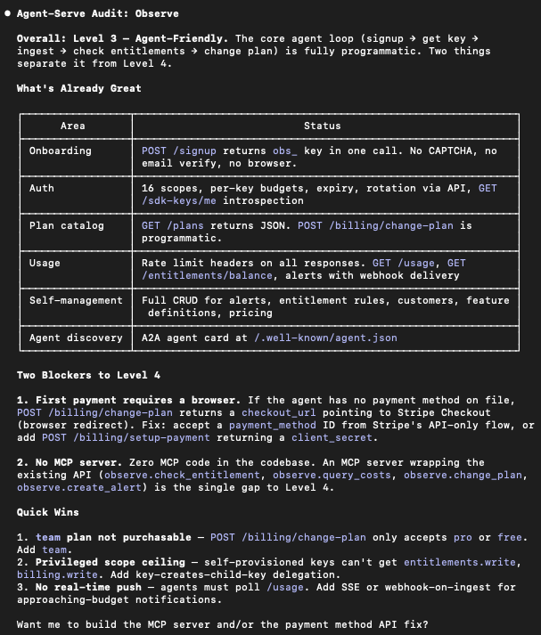

# agent-serve

Make your product self-serve for AI agents.

## Install

```bash
# Everything (full audit + all 6 focused skills)
npx skills add katrinalaszlo/agent-serve

# Or just the area you need
npx skills add katrinalaszlo/agent-serve --skill agent-serve-onboarding
npx skills add katrinalaszlo/agent-serve --skill agent-serve-auth
npx skills add katrinalaszlo/agent-serve --skill agent-serve-purchasing
npx skills add katrinalaszlo/agent-serve --skill agent-serve-usage
npx skills add katrinalaszlo/agent-serve --skill agent-serve-self-management
npx skills add katrinalaszlo/agent-serve --skill agent-serve-dev-ready
```

## What this is

A set of Claude Code skills that find what's blocking agents from using your product and tell you exactly what to build to fix it.

Agents are becoming buyers. If they can't sign up, authenticate, pay, and use your product programmatically, they'll route spend to competitors that let them self-serve.

## Skills

| Skill | Command | The question it answers |
|-------|---------|------------------------|
| **Full audit** | `/agent-serve` | Can agents buy and use your product end-to-end? |
| **Onboarding** | `/agent-serve-onboarding` | Can an agent create an account without a browser? |
| **Auth** | `/agent-serve-auth` | Can an agent prove identity without human ceremony? |
| **Purchasing** | `/agent-serve-purchasing` | Can an agent select a plan and pay via API? |
| **Usage** | `/agent-serve-usage` | Can an agent track its own consumption? |
| **Self-Management** | `/agent-serve-self-management` | Can an agent change plans or cancel without a human? |
| **Dev Ready** | `/agent-serve-dev-ready` | Is your API good to build against? |

Each skill works in two modes:

```bash
/agent-serve-auth https://example.com    # Audit a live product
/agent-serve-auth                        # Audit from codebase
```

## What you get

For each area, the skill tells you:
- **What exists today** — what the product already supports
- **What blocks agents** — the specific friction
- **What to build** — concrete fixes with effort estimates, referencing how companies like Stripe, Cloudflare, and Twilio solved each problem

### Example output



## The patterns that matter

**Onboarding:** `POST /v1/accounts` returns account ID + API key in one call. No CAPTCHA, no email loop. Deploy-first-claim-later for dev tools.

**Auth:** OAuth Client Credentials for machine-to-machine. Scoped API keys with rotation endpoint. No magic links, no SMS OTP on programmatic paths.

**Purchasing:** Expose what Stripe already supports as API endpoints. Human saves a payment method once (Setup Intent), agent reuses it. `GET /plans` returns the catalog, `POST /subscriptions` creates one. No browser checkout required. Publish `pricing.json` for machine-readable pricing discovery.

**Usage:** Rate limit headers on every response. Dedicated usage endpoint with current-period data. Threshold webhooks so agents can self-throttle.

**Management:** Plan changes, cancellation, configuration — all via API. MCP server as the agent-facing interface for products that are ready.

**Dev ready:** Structured JSON errors with type, code, message, and failing parameter. Idempotency keys on mutating endpoints. Cursor-based pagination. API versioning with deprecation policy. OpenAPI spec published. Test mode with separate keys. llms.txt at domain root. Curated MCP server (10-15 tools, not full API dump). A2A Agent Card if exposing agent-to-agent capabilities.

**Starting from zero:** Pick one read endpoint and ship it. Then one write. Then usage visibility. Then programmatic signup. Four weeks from dashboard-only to agent-possible.

## What blocks agents

- CAPTCHA / reCAPTCHA
- Email verification loops
- SMS OTP
- Browser-only OAuth consent
- "Contact sales" gates
- PDF-only documentation
- Dashboard-only configuration

## What's next

**Part 2: Is Your Site Ready for AI?** — How agents find and evaluate your product, what they look for, and how to measure whether you're showing up.

**Part 3: Onboarding Agents** — The full agent-ready funnel: what onboarding, auth, purchasing, and account management actually require, where industry recommendations fall short, and what to build.

## Author

Kat Laszlo — [@katlaszlo](https://x.com/Katlaszlo)
